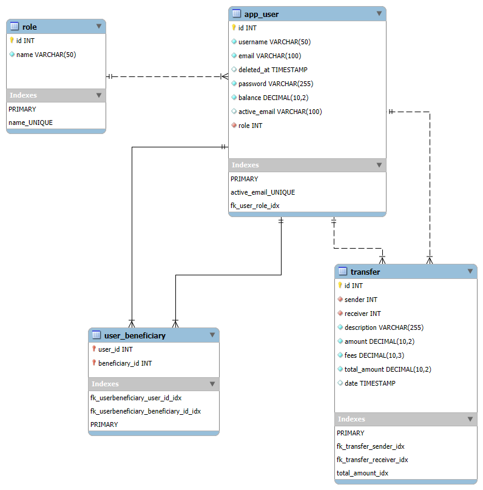

## Le projet

Prototype d'une application de transfert d'argent entre utilisateurs. 

## L'application

Les utilisateurs doivent pouvoir :
 - s'inscrire à l'aide d'un identifiant e-mail unique,
 - se connecter avec leurs identifiants personnels,
 - ajouter des amis à leur réseau pour leur transférer de l'argent. 

## Modèle Physique de Données

Le diagramme EER ci-dessous décrit la structure des tables et les relations entre elles dans la base de données.

### Tables :
- **user** : contient les informations sur les utilisateurs.   
*id* : identifiant unique de l'utilisateur, 
*username* : nom d'utilisateur, 
*email* : adresse e-mail (ne peut pas être partagée entre plusieurs utilisateurs), 
*password* : mot de passe, 
*balance* : solde du compte en euros (ne peut pas être négatif), 
*deleted_at* : date de suppression du compte (soft-delete), 
*active_email* : colonne générée pour contenir l'adresse e-mail d'un l'utilisateur actif. Si le compte de l'utilisateur a été supprimé, un nouveau compte avec la même adresse e-mail peut être créé. 

Le champ `active_email` permet de conserver l'unicité de l'adresse e-mail uniquement parmi les comptes utilisateurs actifs (non supprimés).   
   
- **transfer** : enregistre les transactions entre utilisateurs.   
*id* : identifiant unique de la transaction, 
*sender* : identifiant de l'utilisateur qui envoie de l'argent, 
*receiver* : identifiant de l'utilisateur qui reçoit de l'argent, 
*description* : description de la transaction qui permet de renseigner un motif,
*amount* : montant de la transaction. 
  
Les transactions sont liées aux utilisateurs via les clés étrangères `sender` et `receiver` qui font référence à `user.id`.
   
- **user_beneficiary** : gère les relations entre utilisateurs.   
*user_id* : identifiant de l'utilisateur qui a ajouté un bénéficiaire, 
*beneficiary_id* : identifiant de l'utilisateur ajouté aux bénéficiaires (la réciprocité n'est pas obligatoire). 
   
Les connexions entre utilisateurs sont gérées via les clés étrangères `user_id` et `beneficiary_id` qui font référence à `user.id`.

### Schéma de la base de données et données initiales

[Le schéma](src/main/resources/schema.sql), conçu pour être utilisé avec MySQL, contient non seulement la définition complète des tables et des relations (clés primaires, clés étrangères, contraintes), mais aussi un **jeu de données initial**.  
Ces données permettent de comprendre le modèle en contexte réel et de tester rapidement le fonctionnement de l'application sans avoir à insérer manuellement des enregistrements. 

