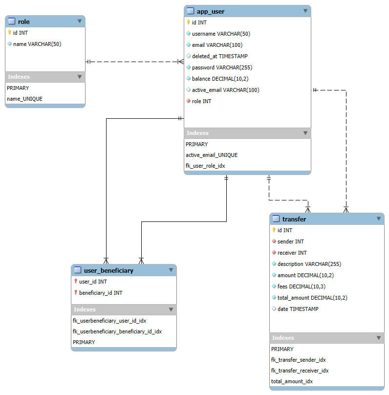

# PayMyBuddy API
Cette API REST sécurisée gère les transferts d'argent entre particuliers, le solde des comptes, les relations entre bénéficiaires ainsi que l'authentification et l'autorisation des utilisateurs.
## Architecture
### Modèle Physique de Données
  

## 1. Rôle
L'application fournit les fonctionnalités suivantes :
 - Authentification : émission et validation de jetons stockés dans des cookies `HttpOnly`. Contrôle d'accès par programmation orientée aspect (AOP) garantissant l'isolation des données par utilisateur (`@AuthenticatedUser`, `@AdminOnly`).
 - Gestion des relations (bénéficiaires) : ajout/suppression de contacts par e-mail avec validation d'unicité et interdiction d'auto-liaison.
 - Transferts d'argent : exécution des débits/crédits avec prélèvement automatique des frais de service (0,5 %).
 - Cycle de vie des comptes : gestion du soft-delete (désactivation d'e-mail pour réinscription possible) et suppression définitive sécurisée (avec délai de rétention).

## 2. Choix techniques
 - Langage : **Java 21**
 - Framework : **Spring Boot 3.5.0** (Spring MVC, Spring Security, Spring Data JPA)
 - Sécurité : **Spring Security** OAuth2 Resource Server, Nimbus Jose JWT
 - Base de données : **MySQL 8** / **PostgreSQL** (support multi-profils avec scripts SQL d'initialisation)
 - Tests & Couverture : **JUnit 5**, Spring Security Test, JaCoCo
 - Journalisation : Log4j2

## 3. Configuration
L'application charge sa configuration depuis `src/main/resources/application.properties` ou des profils dédiés (`mysql`, `postgresql`).

`spring.profiles.active` | Profil de base de données actif | `mysql` ou `postgresql`   
`spring.datasource.url` | URL JDBC de connexion BDD | `jdbc:mysql://localhost:3306/paymybuddy?serverTimezone=UTC`  
`spring.datasource.username` | Identifiant BDD | *À renseigner*   
`spring.datasource.password` | Mot de passe BDD | *À renseigner*   
`spring.sql.init.mode` | Initialisation du schéma SQL (`always` au 1er boot, puis `never`) | `always`    
`admin.default.password` | Mot de passe initial du compte `admin@email.com` | *À renseigner*   
`jwt.public-key-location` | Chemin vers la clé publique RSA | `classpath:jwt-keys/public_key.pem`    
`jwt.private-key-location` | Chemin vers la clé privée RSA | `classpath:jwt-keys/private_key.pem`   

## 4. Principaux endpoints
### Authentification & Session

 - `GET /api/auth_check` : vérification de la session active et renvoi des informations de l'utilisateur connecté.  
 

 - `POST /api/register` : inscription d'un nouvel utilisateur.   
 - `POST /api/login_check` : authentification et injection du cookie de session `JWT`.    
 - `POST /api/logout` : révocation du cookie de session.   

### Gestion du compte utilisateur et des relations 

 - `GET /api/user/{id}` : consultation du profil utilisateur (protégé par AOP `@AuthenticatedUser`).     
 - `GET /api/user/{id}/transfers` : récupération de la page de transfert (solde, liste des bénéficiaires, historiques des transferts émis et reçus).
 
 
 - `POST /api/user/{id}/add-relation` : ajout d'un bénéficiaire via son e-mail.    


 - `PATCH /api/user/{id}/change-user-info` : modification de l'e-mail et/ou du mot de passe.  
 - `PUT /api/user/{id}/delete-account` : désactivation logique du compte (soft-delete).

 
  - `DELETE /api/user/{id}/remove-relation/{beneficiaryId}` : suppression d'un bénéficiaire. 
  
### Transferts d'argent
 - `POST /api/transfer` : exécution d'un virement entre le compte émetteur et un bénéficiaire validé (vérification de solde, montant min. et calcul automatique des frais de 0,5 %).

### Administration (`ROLE_ADMIN`)
 - `PUT /api/admin/user/{id}/change-password` : réinitialisation administrative du mot de passe.
 - `DELETE /api/admin/user/{id}` : suppression définitive (hard delete) d'un compte soft-deleted après expiration du délai légal.

## 5. Démarrage rapide
### Prérequis
 - Java 21 SDK
 - Maven 3.9+
 - Instance MySQL 8 ou PostgreSQL démarrée
 - OpenSSL (pour la génération des clés RSA)

### 1. Générer des clés secrètes RSA
Créez le dossier `src/main/resources/jwt-keys/` et générez la paire de clés cryptographiques :

```
#générer la clé privée RSA 2048 bits
openssl genrsa -out src/main/resources/jwt-keys/private_key.pem 2048

#extraire la clé publique correspondante
openssl rsa -pubout -in src/main/resources/jwt-keys/private_key.pem -out src/main/resources/jwt-keys/public_key.pem
```


### 2. Lancer l'application
`/mvnw spring-boot:run`
